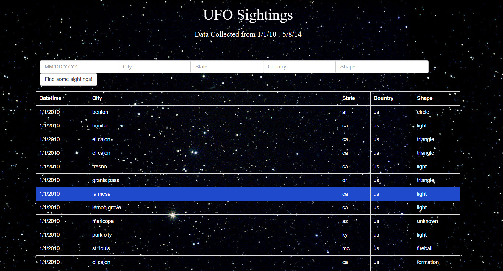

# JavaScript and DOM Manipulation
Using UFO Sightings data from `data.js`, a table was appended into an html page by calling a function through Javascript. Multiple `<input>` tags were added so that users can search the data with specific criteria based on the table columns: `date`, `city`, `state`, `country`, and `shape`. Another function was used to search through the data and filter out rows that met the criteria.

### Here is a screenshot of the final web page:

### The webpage can be accessed at https://victoria-lam.github.io/UFO_Sightings/
